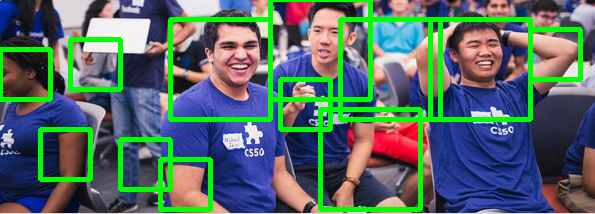
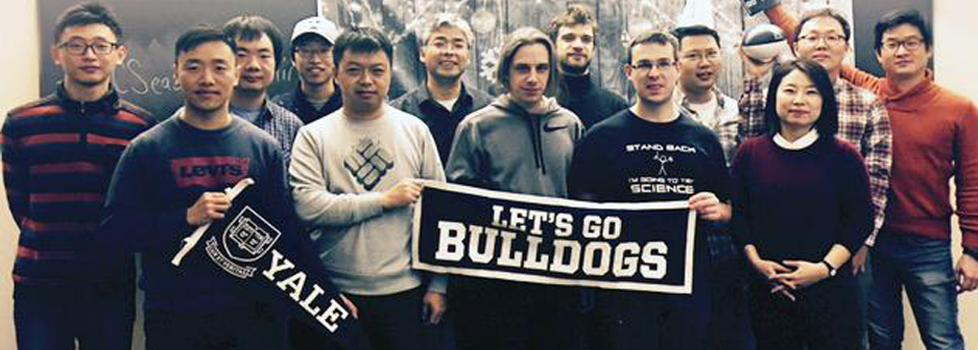
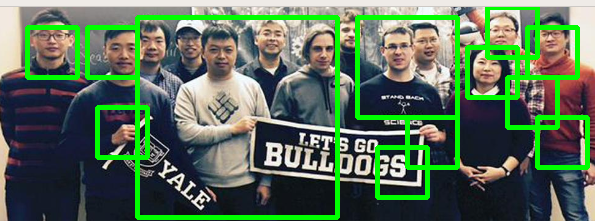
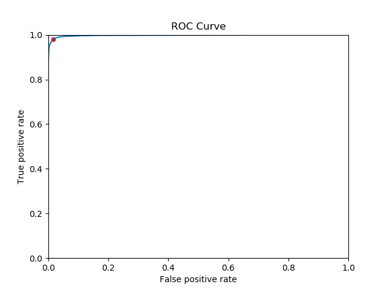

# My Face Classifier
A face classifier that detect the number of faces in a photo, based on training a deep learning model using the Keras API and the VGGnet neural network, and using OpenCV and the sliding window approach to detect faces on input images.

## Key Steps to Run the Classifier
1. Download a subset of the [Face Detection Dataset and Benchmark](http://vis-www.cs.umass.edu/fddb/) 
from [this link](https://drive.google.com/open?id=1JIIalRu5WZQ01p-S6mBxzHV8ZMqAJcdH) and place it in 
the /face_detection directory.

   > The data is provided as a [numpy npz file](https://docs.scipy.org/doc/numpy-1.15.1/reference/generated/numpy.savez.html). The .npz file format is a zipped archive of files named after the variables they contain. 
   The archive is not compressed and each file in the archive contains one variable in .npy format. 
   
2. Run /face_detection/train_face_detection.py and load the training data with the following command:

   ```bash
   (venv) $ ./train_face_detection.py --input 64x64_data.npz
   Loaded 11038 training examples.
   ```
   
   > The `input` is organized as a 4-D tensor of dimension NxHxWxC, where N
   corresponds to the number of examples, H is the height of input images, W is their width, and C
   is the number of channels per image. In general, the dataset has color images of 64x64 pixels 
   (i.e., W=H=64 and C=3). The channels are organized in Blue-Green-Red (bgr) order.
   
   > The `target` is a single number: 1 if the corresponding input image shows a face, or 0 otherwise.
   Thus, the target tensor is 2D. It has shape Nx1.
   
3. Train the model using the 64x64_data.npz dataset:

    ```bash
    (venv) $ ./train_face_detection.py --input 64x64_data.npz [--lr 1e-4] [--epochs 100] [--batch_size 200]
    ```
    
4. The script /face_detection/window_detection.py runs the face classifier on a sliding window over an input image. 
The script detects multiple faces on the input by sliding a window of various scales. 
For example, given the following input image from the Yale Computer Science website:

    
    
    The script should output face predictions to the screen:
    
    ```bash
    (venv) $ ./window_detection.py --input ../cs50_2.jpg --logs_dir <path-to-logs-folder>
    ...
    DETECTIONS:
    [[ 280.           70.          330.          120.            0.97373563]
     [ 190.           10.          290.          110.            0.95309627]
     [ 290.            0.          390.          100.            0.96896017]
     [ 460.           40.          510.           90.            0.95603698]
     [ 410.           20.          460.           70.            0.99236625]
     [ 510.           10.          560.           60.            0.99526775]
     [ 150.            0.          200.           50.            0.96062028]]
    ```
    where each row of the printed matrix contains [min_x, min_y, max_x, max_y, prob] for a given
    face detection. The first
    four columns are the top-left (min_x, min_y) and bottom-right (max_x, max_y) coordinates of 
    the bounding box corresponding to a face detection. The last column is the detection probability
    output by the model.

    When the script finishes, it also shows an image with the boxes:

    
    
    > The script uses non_max_suppression() function to 
    group overlapping boxes together
    
    Using the best threshold for the predicted probabilities, 0.4, the script also runs on 
    
    
    
    And produces the following output:
    
    


## Explanation
The `main` function of the  train_face_detection.py script:

   a. Splits the input data into a training and validation set.
   
   b. Normalizes the training data such that the pixel values are floats in [0,1] rather than integers in [0,255].
   
   c. Builds a convolutional neural network model with the TensorFlow Keras API to predict 
   whether the input image corresponds to the face of a person or not. The output of the
   network should be a probability (i.e., a float between 0 and 1) corresponding to the 
   likelihood that the input image shows a human face.
   
   d. Trains the model based on the input arguments: batch_size, epochs, lr, val, logs_dir.
   These arguments are all defined in the bottom section of the script, when they are
   added to the [ArgumentParser](https://docs.python.org/2/library/argparse.html).
   
   e. After training, saves one file to disk:
   
   - **weights.h5:** model parameters. 
   
   The convolutional neural networks for image classification I implemented is VGGnet.


I also inspected how accuracy changes as a function of the threshold to better understand if 0.5 is a good threshold value for my classifier.
The script /face_detection/plot_roc_curve.py computes predictions for all of the examples on the input data. Based on these predictions and the target values,
It plots a [Receiver Operating Characteristic (ROC)](https://en.wikipedia.org/wiki/Receiver_operating_characteristic) curve that 
shows the performance of the model based on the True Positive Rate (TPR: the number of correct face predictions over the total number of positive (face) examples 
in the input data) and False Positive Rate (FPR: the number of false (or incorrect) face predictions over the total number of negative examples in the 
input data). The best threshold found given the TPR and FPR values is 0.4, with the figure plotted below:



## Further Work
To detect faces in a more efficient way than with a windowed approach, we could use a region-based method by generating region proposals for detection. Through image segmentation, we could group similar pixels in an image to form a region, then feed the regions to the classifier. We could further improve the efficiency by using the selective search algorithm, which uses multiple strategies instead of just a single run of image segmentation, to cover as many cases as possible; the algorithm leverages hierarchical grouping-based segmentation, calculating similarity based on features such as textures and colors, starting with initial regions, then merging similar regions to form new regions, and continuing the process till the whole image is represented using a single region; the regions in each step are added to the region proposals. 

Another improvement could be that instead of keeping object detection separate from region proposals, we could borrow the idea of Faster RCNN and have a unified approach for the tasks, where region proposal and the face classifier share the same convolutional features. We could build a region proposal network that outputs the objectness score, which indicates whether the piece of image in question contains a background or a foreground object, i.e. a binary classification task for having a face or not having a face. To construct such a region proposal network, we could first have the feature map generated by the last convolutional layer in the shared convolutional network, then slide a small network over the feature map, each output being fed into two fully connected networks (a classification layer and a regression layer). The regression layer outputs coordinates for each of the maximum k boxes, while the classification layer outputs the probability that each of the k boxes contain an object or not.
